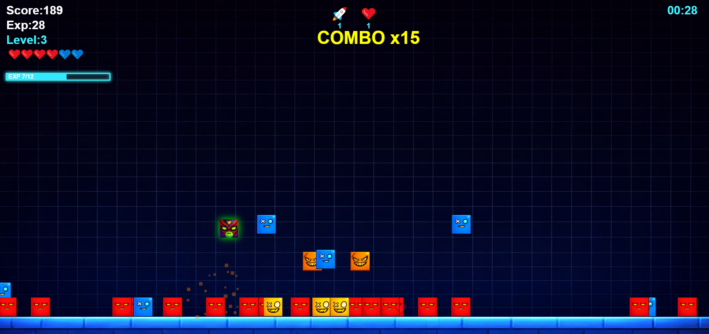

# Jumping Souls

A solo game-jam project developed in **48 hours** for **Global Game Jam 2026**.

**[Play Jumping Souls](https://jumproguelike-arngames.netlify.app/)** · **[Global Game Jam entry](https://globalgamejam.org/games/2026/jumping-soul-8)**

## Project overview

Jumping Souls is a compact playable experiment built around an escalating single level, upgrades, and game balance. The challenge was to take a game concept from idea to playable project within the jam's 48-hour time limit.

## My contribution

This was a **solo project**. I was responsible for:
- Game concept and design
- Gameplay structure, upgrades, and balance
- Rapid prototyping and iteration
- AI-assisted implementation and visual creation

AI tools supported code and visuals; the game design and creative decisions were mine.

## Play

- **Playable build:** https://jumproguelike-arngames.netlify.app/
- **Game Jam page:** https://globalgamejam.org/games/2026/jumping-soul-8

> A time-boxed game-jam prototype, rather than a commercial release.
